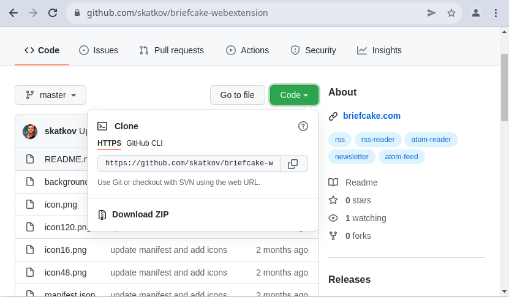
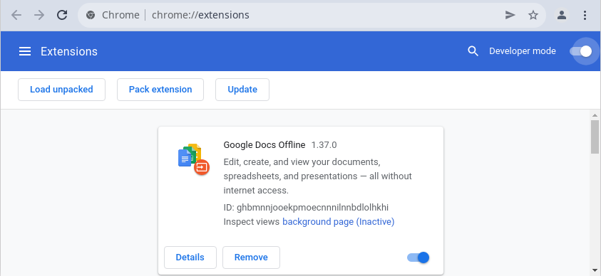
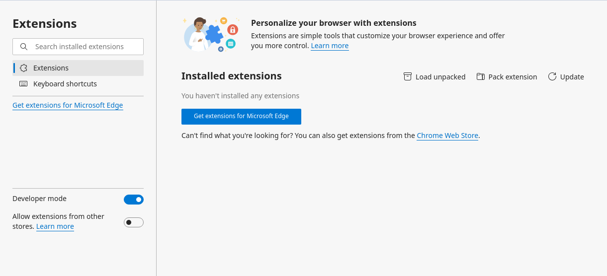

# briefcake-webextension
Light browser wrapper around briefcake.com website. My first attempt at browser integrations.

https://briefcake.com is a project that saves favorite websites, syndicates them and sends updates with a beatiful email. 

# Installation
If you have **Firefox**, this extension is actually [published on addons pages](https://addons.mozilla.org/en-US/firefox/addon/briefcake/?utm_source=addons.mozilla.org&utm_medium=referral&utm_content=search). But for **Chromium-based browser** you need to add this extensions without Chrome Web Store.

**Download zip archive of this repo**
- Find button "Code"
- Pick "Download ZIP" option

**Load extesion**

- go to Chrome ->"extensions" 
- Enable "developer" checkbox
- Click "load unpacked" and point to folder with extracted archive

Loading your own extension is possible in all chromium-based browsers. Here is example with Edge browser:

# Implementation
This extension should work with any browser that supports WebExtensions format, but was tested only on firefox and chrome. Original goal was to support as much browsers as possible with a single codebase.

Unfortunately, Chrome Web Store doesn't approve such wrapper extensions. So be on a lookout for v2, that will eventually end up in Chrome Web Store ;)

